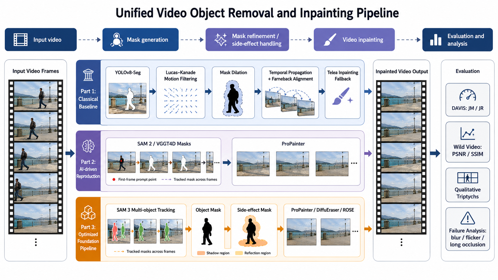
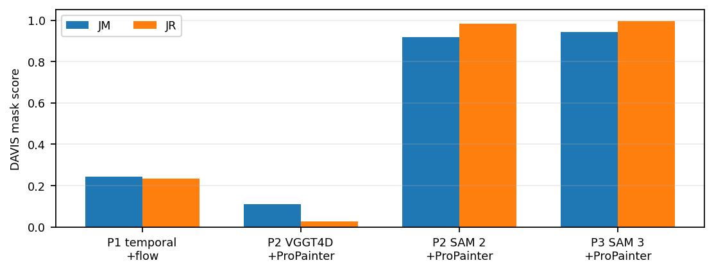
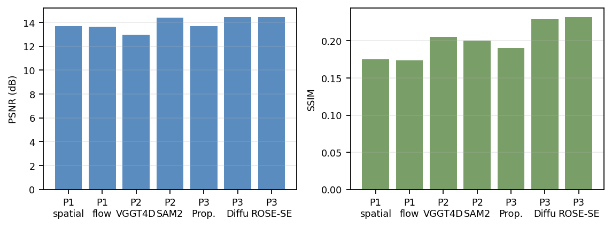
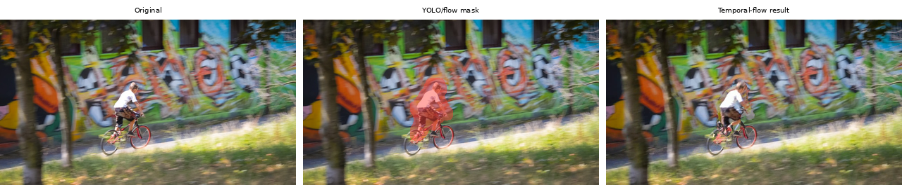
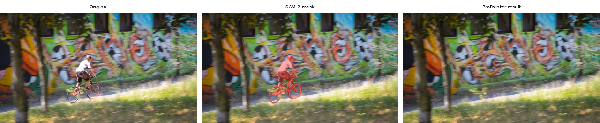
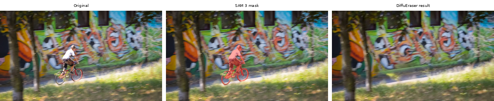
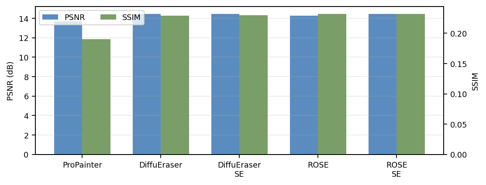
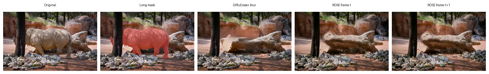

# AIAA3201 Project: Video Object Removal and Inpainting

Project page: https://chikit-wong.github.io/AIAA3201-Introduction_to_Computer_Vision-Project/

This repository contains the AIAA3201 final project for **Project 3: Video Object Removal & Inpainting**. The goal is to automatically identify dynamic foreground objects in a video, remove them, and restore the missing background using temporal information and video inpainting.

The project follows the course requirement that all three parts are mandatory:

| Part | Goal | Implemented pipeline |
| --- | --- | --- |
| Part 1 | Hand-crafted baseline | YOLOv8-Seg masks, Lucas-Kanade motion filtering, mask dilation, temporal background propagation, OpenCV Telea fallback |
| Part 2 | SOTA reproduction | SAM 2 or VGGT4D masks with ProPainter video inpainting |
| Part 3 | Optimization and extension | SAM 3 masks with ProPainter, DiffuEraser, and ROSE backends, plus side-effect masks for shadows and boundary artifacts |

## Highlights



- Implements all three required project parts.
- Evaluates mask quality on DAVIS with `JM` and `JR`.
- Evaluates paired Wild Video restoration quality with `PSNR` and `SSIM`.
- Provides processed videos and qualitative triptychs for the required sample data.
- Keeps external repositories and model checkpoints out of Git, with setup scripts to download them.

## Repository Layout

```text
.
├── data/
│   ├── DAVIS/                 # DAVIS dataset, ignored by Git
│   └── Wild_Video/            # Paired wild videos and clean references, ignored by Git
├── docs/
│   ├── assets/                # Figures used by README/report/project page
│   └── index.html             # Static project page
├── part1/                     # Classical baseline
├── part2/                     # SAM 2 / VGGT4D + ProPainter reproduction
├── part3/                     # SAM 3 + ProPainter/DiffuEraser/ROSE exploration
├── report/                    # CVPR-style report source and PDF, ignored by Git
├── scripts/                   # Project-level helper scripts
└── README.md
```

Large files such as datasets, checkpoints, generated videos, `results/`, `models/`, and `external/` repositories are intentionally ignored by Git. Recreate them with the setup and run commands below.

## Environment Setup

Use Python 3.10. The three parts have separate environments because the external methods depend on different model stacks.

### Part 1

```bash
cd part1
conda env create -f environment.yml
conda activate cv
```

Main dependencies: OpenCV, Ultralytics YOLOv8, PyTorch, scikit-image, NumPy, PyYAML, tqdm, Pillow.

### Part 2

```bash
cd part2
conda env create -f environment.yml
conda activate cv-2
bash setup.sh
```

`setup.sh` prepares the external repositories and checkpoints for:

- VGGT4D: `https://github.com/3DAgentWorld/VGGT4D`
- SAM 2: `https://github.com/facebookresearch/sam2`
- ProPainter: `https://github.com/sczhou/ProPainter`

If the automatic setup fails on a machine with restricted network access, clone/download these projects manually into `part2/external/` following the paths in `part2/configs/default.yaml`.

### Part 3

```bash
cd part3
conda env create -f environment.yml
conda activate cv3
bash setup.sh
```

Part 3 uses:

- SAM 3: `https://github.com/facebookresearch/sam3`
- DiffuEraser: `https://github.com/lixiaowen-xw/DiffuEraser`
- ROSE: `https://github.com/Kunbyte-AI/ROSE`
- ProPainter reused from `part2/external/ProPainter`

The one-command setup runs repository setup and checkpoint download. The two stages can also be run separately:

```bash
cd part3
bash scripts/setup_external_repos.sh
bash scripts/download_models.sh
```

Expected model directories after setup:

```text
part3/models/sam3/
part3/models/diffuEraser/
part3/models/sd-vae-ft-mse/
part3/models/stable-diffusion-v1-5/
part3/models/Wan2.1-Fun-1.3B-InP/
part3/models/ROSE_transformer/
```

Some checkpoints are large and may require ModelScope or Hugging Face access. See `part3/README.md` for backend-specific notes.

## Data Preparation

The course requires processed videos for:

- Wild Video, filmed or generated by the team.
- Sample data: `bmx-trees` and `tennis`.
- DAVIS is optional but recommended for stronger evaluation; this project evaluates all DAVIS validation sequences for mask quality.

Expected local layout:

```text
data/DAVIS/
├── JPEGImages/480p/<sequence>/
└── Annotations/480p/<sequence>/

data/Wild_Video/
├── input_with_person/Wild_Video1.mp4
├── input_with_person/Wild_Video2.mp4
├── clean_gt_no_person/Wild_Video1-Ground_Truth.mp4
└── clean_gt_no_person/Wild_Video2-Ground_Truth.mp4
```

The clean Wild Video ground truth is used only for evaluation, not for inference.

## How to Run

Run commands from each part directory unless stated otherwise.

### Part 1: Classical Baseline

Process the mandatory sample sequences from DAVIS:

```bash
cd part1
conda activate cv
python run.py --davis --output results/results_davis_full/temporal_aligned
```

Run ablations:

```bash
python run.py --davis --no-temporal --output results/results_davis_full/spatial_only
python run.py --davis --config configs/davis_all_temporal_no_align.yaml --output results/results_davis_full/temporal_no_align
```

Evaluate masks against DAVIS annotations:

```bash
python evaluate.py \
  --pred results/results_davis_full/temporal_aligned \
  --davis-root ../data/DAVIS \
  --save-json results/results_davis_full/temporal_aligned_metrics.json
```

Process a custom video:

```bash
python run.py --input path/to/video.mp4 --output results/results_wild_video/my_video
```

### Part 2: SAM 2 / VGGT4D + ProPainter

Run SAM 2 + ProPainter:

```bash
cd part2
conda activate cv-2
python run.py --method sam2 --sequences bmx-trees tennis --gpu 0
```

Run VGGT4D + ProPainter:

```bash
python run.py --method vggt4d --sequences bmx-trees tennis --gpu 0
```

Evaluate:

```bash
python evaluate.py \
  --pred results/results_davis_full/sam2 \
  --davis-root ../data/DAVIS \
  --save-json results/results_davis_full/sam2_metrics.json
```

For Wild Video, first build DAVIS-like frames and first-frame prompts, then run the provided SLURM scripts:

```bash
sbatch slurm_sam2_wild.sh
sbatch slurm_vggt4d_wild.sh
```

### Part 3: SAM 3 + Generative Backends

Run one method on a Wild Video clip:

```bash
cd part3
conda activate cv3
python run_part3.py \
  --config configs/sam3_full.yaml \
  --method sam3_diffueraser_side_effect \
  --sequence Wild_Video1 \
  --input ../data/Wild_Video/input_with_person/Wild_Video1.mp4
```

Other supported final methods:

```text
sam3_propainter
sam3_diffueraser_object
sam3_diffueraser_side_effect
sam3_rose_object
sam3_rose_side_effect
```

Evaluate Part 3 on DAVIS masks:

```bash
python evaluate_part3.py \
  --config configs/sam3_full.yaml \
  --method sam3_diffueraser_object \
  --evaluate-davis \
  --sequence bmx-trees tennis \
  --metrics-tag sam3_diffueraser_object
```

Evaluate paired Wild Video restoration:

```bash
python evaluate_part3.py \
  --config configs/sam3_full.yaml \
  --method sam3_diffueraser_side_effect \
  --evaluate-wild \
  --sequence Wild_Video1 Wild_Video2 \
  --metrics-tag sam3_diffueraser_side_effect
```

On the HKUST(GZ) HPC cluster, prefer the SLURM wrappers for GPU runs:

```bash
CONFIG=configs/sam3_full.yaml \
METHOD=sam3_rose_side_effect \
SEQUENCE=Wild_Video1 \
INPUT_VIDEO=../data/Wild_Video/input_with_person/Wild_Video1.mp4 \
sbatch slurm_scripts/run_part3_method.slurm
```

## Output Layout

Each part writes masks, frames, videos, logs, and metrics under its own `results/` directory.

```text
part1/results/results_davis_full/<variant>/<sequence>/
part1/results/results_wild_video/<variant>/<sequence>/

part2/results/results_davis_full/<method>/<sequence>/
part2/results/results_wild_video/<method>/<sequence>/

part3/results/results_davis_full/<method>/
part3/results/results_wild_video/<method>/
part3/results/summary/
```

Typical sequence outputs include:

```text
frames/ or inpainted frames
masks/
visualization/ or logs/
output.mp4 or inpainted.mp4
```

The course sample sequences `bmx-trees` and `tennis` are also copied into `results_sample_data/` where supported.

## Results

### DAVIS Mask Quality

DAVIS reports segmentation quality only. `JM` is mean IoU and `JR` is the recall of frames with IoU at least 0.5.

| Part | Method | #Seq. | JM ↑ | JR ↑ |
| --- | --- | ---: | ---: | ---: |
| Part 1 | Spatial only | 90 | 0.2435 | 0.2355 |
| Part 1 | Temporal, no alignment | 90 | 0.2435 | 0.2355 |
| Part 1 | Temporal + optical-flow alignment | 90 | 0.2435 | 0.2355 |
| Part 2 | VGGT4D + ProPainter | 90 | 0.1090 | 0.0269 |
| Part 2 | SAM 2 + ProPainter | 90 | 0.9167 | 0.9846 |
| Part 3 | SAM 3 + ProPainter | 90 | 0.9423 | 0.9952 |
| Part 3 | SAM 3 + DiffuEraser | 90 | 0.9423 | 0.9952 |
| Part 3 | SAM 3 + DiffuEraser-SE | 90 | 0.9423 | 0.9952 |
| Part 3 | SAM 3 + ROSE | 90 | 0.9423 | 0.9952 |
| Part 3 | SAM 3 + ROSE-SE | 90 | 0.9423 | 0.9952 |



### Wild Video Restoration Quality

Wild Video is evaluated against paired no-person clean videos. Values are averaged over `Wild_Video1` and `Wild_Video2`.

| Part | Method | #Videos | PSNR ↑ | SSIM ↑ |
| --- | --- | ---: | ---: | ---: |
| Part 1 | Spatial only | 2 | 13.6883 | 0.1749 |
| Part 1 | Temporal, no alignment | 2 | 13.6605 | 0.1736 |
| Part 1 | Temporal + optical-flow alignment | 2 | 13.6620 | 0.1737 |
| Part 2 | VGGT4D + ProPainter | 2 | 12.9820 | 0.2057 |
| Part 2 | SAM 2 + ProPainter | 2 | 14.3966 | 0.2002 |
| Part 3 | SAM 3 + ProPainter | 2 | 13.6800 | 0.1902 |
| Part 3 | SAM 3 + DiffuEraser | 2 | 14.4704 | 0.2289 |
| Part 3 | SAM 3 + DiffuEraser-SE | 2 | 14.4680 | 0.2295 |
| Part 3 | SAM 3 + ROSE | 2 | 14.2764 | 0.2319 |
| Part 3 | SAM 3 + ROSE-SE | 2 | 14.4286 | 0.2323 |



### Qualitative Examples

All three triptychs use the same `bmx-trees` frame to make the visual comparison fair.

| Part 1 | Part 2 | Part 3 |
| --- | --- | --- |
|  |  |  |

Part 3 backend comparison:



Failure case:



## Reproducing the Report Tables

The main metric files are:

```text
part1/results/results_davis_full/*_metrics.json
part2/results/results_davis_full/*_metrics.json
part3/results/summary/part3_full_summary.json
part3/results/summary/part3_full_summary.md
```

Project-level helpers:

```bash
python scripts/build_project_davis_summary.py
python part3/scripts/build_part3_summary.py
```

## Notes for Running on HPC

GPU inference should be submitted through SLURM rather than executed directly on the login node. A short A40 job can usually use:

```bash
sbatch --partition=debug --gres=gpu:a40:1 <script.slurm>
```

For longer full-sequence runs, use the project-provided SLURM scripts in `part2/` and `part3/slurm_scripts/`, or switch to a longer GPU partition according to cluster availability.

## References

This project builds on YOLOv8, SAM 2, SAM 3, VGGT4D, ProPainter, DiffuEraser, ROSE, OpenCV inpainting, and the DAVIS video object segmentation dataset. Full academic citations are listed in the report bibliography.
